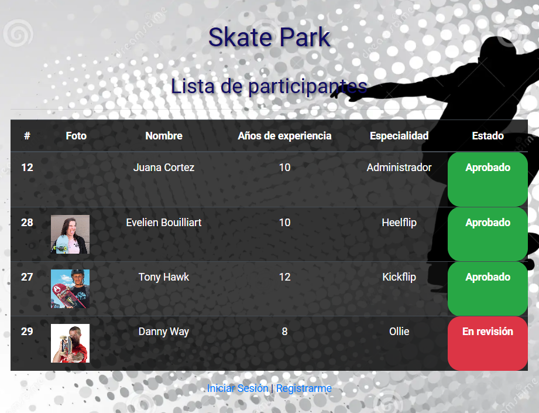

# !Hola, mi nombre es Juana Cortez 👋
### Estudiante de ciberseguridad y desarrolladora Full Stack en formación. 🛡️💻

👋 Bienvenido a mi perfil de GitHub! Soy **Juana Cortez Ramos**, actualmente una estudiante apasionada de Ingeniería en Ciberseguridad en el Instituto Profesional Escuela De Comercio de Santiago.

### 🌎 Ubicación
- 📍 **Ciudad:** La Serena, Chile

### 🚀 Sobre Mí
- 🎓 **Educación:** Estudiando Ingeniería en Ciberseguridad.
- 💼 **Especialización:** HTML, CSS, JavaScript, Node.js.
- 🌐 **Interés:** Seguridad de aplicaciones web y bases de datos PostgreSQL.

### 💡 Experiencia
Aunque aún no cuento con experiencia profesional en el campo, mi educación en ciberseguridad y desarrollo Full Stack me equipa con un conocimiento sólido y una base técnica fuerte. Estoy ansiosa por aplicar lo aprendido en proyectos reales y colaborar en soluciones innovadoras.

### 🌍 Pasión
Apasionada por aprender y aplicar conocimientos de seguridad en todos los aspectos del desarrollo de software, con el objetivo de fortalecer la infraestructura tecnológica y proteger los datos.

### 📫 Contacto
Para colaboraciones o consultas, no dudes en contactarme:
- 📧 **Email:** [j.cortez@hotmail.cl](mailto:j.cortez@hotmail.cl)

### 📁 Proyecto Destacado: Sistema de Gestión para Parques de Skate

**Descripción:** Este proyecto es un sistema de gestión de participantes para un parque de skate. Permite a los administradores aprobar participantes y cambiar su estado, mientras que los participantes pueden registrarse, iniciar sesión y modificar su información.

### 🛠 Tecnologías Usadas
- **Backend:** Node.js, Express, JWT (JSON Web Tokens), bcrypt.js
- **Frontend:** Express Handlebars, Bootstrap, jQuery
- **Datos:** PostgreSQL
- **Extras:** express-fileupload, Socket.io

---

¡Gracias por visitar mi perfil!
